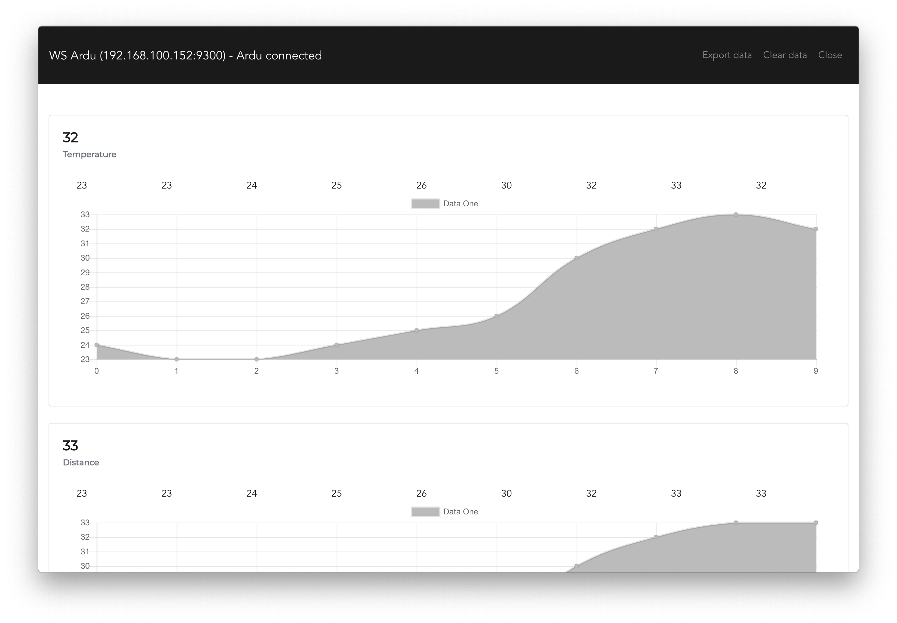

# ws-ardu




Starts a `simple-websocket-server` on port `9300` and logs data to app. You can export the whole data log to csv via the `Export data` button.


### Data payload schema

```ts
{
    "t":string, // The sensor "type" or "alias"
    "p":number  // The value to be plotted/logged
}
```

## Client setup

You may use any client device that has a Wifi antenna and is websocket enabled. Here is an example with `Arduino`:

```arduino
#include <ArduinoHttpClient.h>
#include <WiFi101.h>

char serverAddress[] = "192.168.0.101";  // server address displayed on WS Ardu
int port = 9300;

WiFiClient wifi;
WebSocketClient client = WebSocketClient(wifi, serverAddress, port);
int status = WL_IDLE_STATUS;
int count = 0;
char ssid[] = "My Super Wifi Network";
char pass[] = "verysecretpassword";
void setup() {
  Serial.begin(9600);
  while ( status != WL_CONNECTED) {
    Serial.print("Attempting to connect to Network named: ");
    Serial.println(ssid);                   // print the network name (SSID);
    // Connect to WPA/WPA2 network:
    status = WiFi.begin(ssid, pass);
  }

  // print the SSID of the network you're attached to:
  Serial.print("SSID: ");
  Serial.println(WiFi.SSID());

  // print your WiFi shield's IP address:
  IPAddress ip = WiFi.localIP();
  Serial.print("IP Address: ");
  Serial.println(ip);
  Serial.println("starting WebSocket client");
  client.begin();
}

void loop() {
  float r1 = (float)rand() / (float)(RAND_MAX / 255.0f); //random value
  float r2 = (float)rand() / (float)(RAND_MAX / 1024.0f); //random value
  sendTelemetry("sensor1", r1);
  sendTelemetry("sensor2", r2);
  sendTelemetry("sensor3", r1);
  sendTelemetry("sensor4", r1);
  sendTelemetry("sensor5", r2);
  sendTelemetry("sensor6", r1);
  // simulate computing
  delay(500);
}

int sendTelemetry(String sensor, float data) {
  if (client.connected()) {
    client.beginMessage(TYPE_TEXT);
    client.print("{ \"t\":\"" + sensor + "\",\"p\": ");
    client.print(data);
    client.print("}");
    client.endMessage();
  }
}
```

## Development Project setup
```
yarn install
```

### Compiles and hot-reloads for development
```
yarn electron:serve
```

### Compiles and minifies for production
```
yarn electron:build
```

## Future work

- [ ] Make data "time aware"
- [ ] Generate custom visualization for common sensors